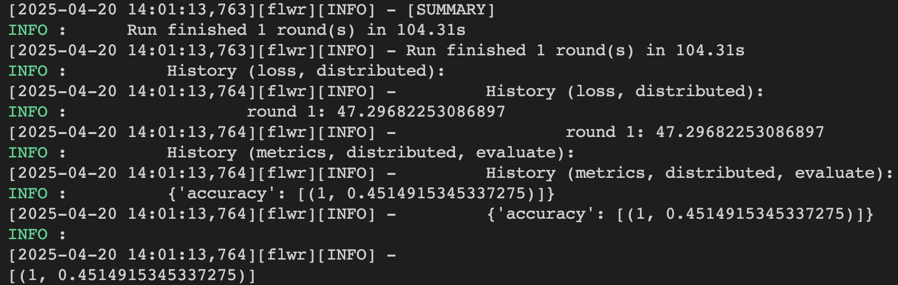

## Result

Run FedPFT on fed-isic2019 dataset for a Mac with an Apple M-series chip.
```bash

python -m fedpft.main dataset=isic device=mps num_clients=4 num_rounds=1 batch_size=32 num_gpus=0

```
Compare with FedAvg




